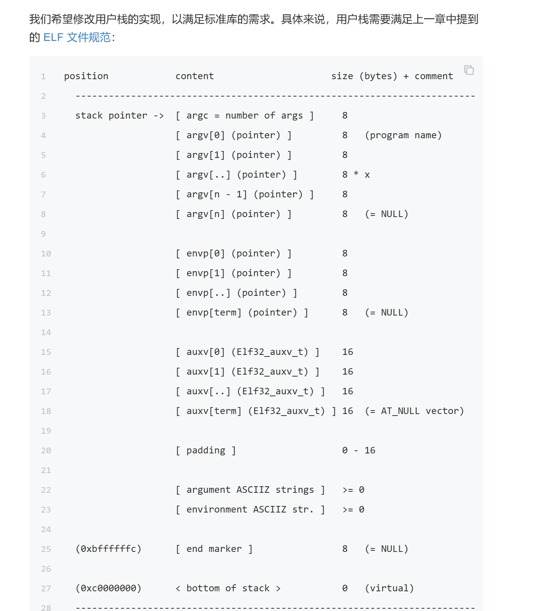
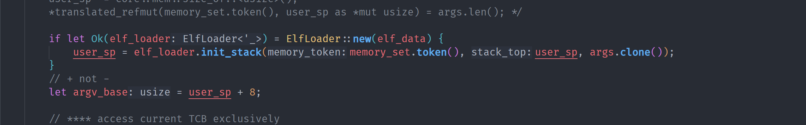
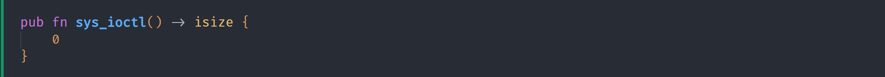
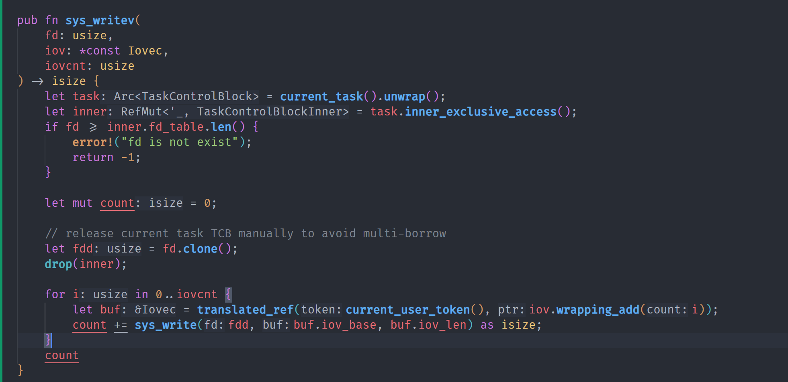
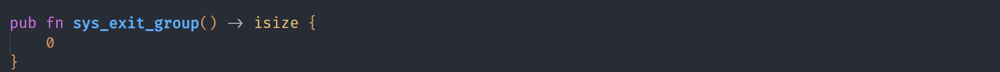
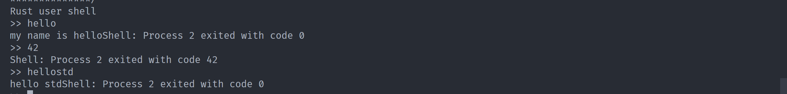
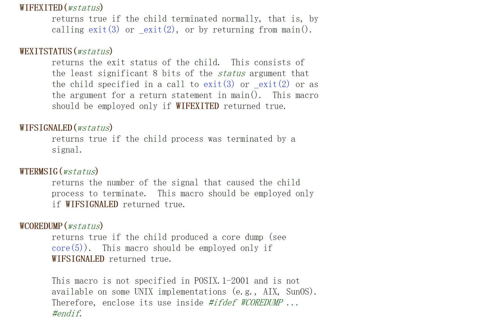
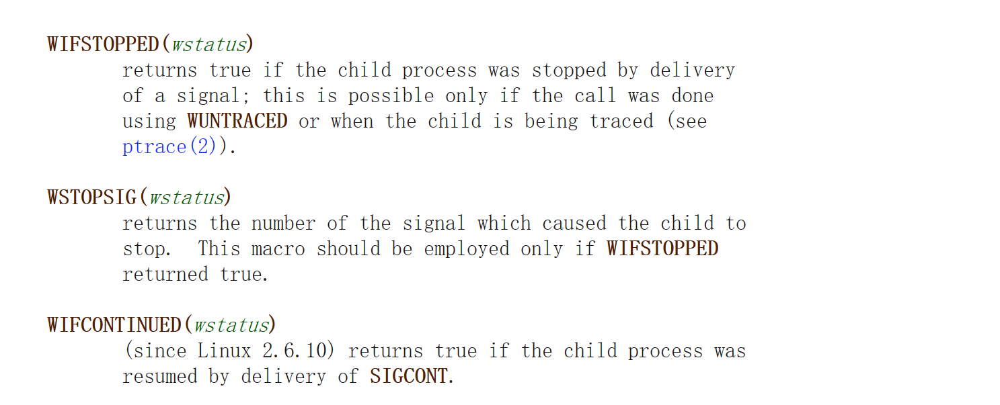

# 实验：

首先修改exec,利用引入的loaders里的new 和 init_stack，输出-4（ch7的trap有问题，应该是trap的handler为0了

然后发现缺少syscall 29，尝试输出0，过了（没懂这个syscall具体干了啥

然后发现缺少syscall 96，就是一个实现缓冲区的write，调用write，记得释放pcb的占用

最后发现缺少syscall 94，没实现线程，直接返回0（虽然文档上说没有返回值

# 问答：

没太懂问什么，二进制就是每一位表示一个状态吧